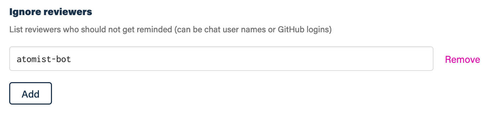

## Before you get started

Connect and configure these integrations:

1.  [**GitHub**][github] _(required)_
2.  [**Slack**][slack] or [**Microsoft Teams**][msteams] _(required)_

[github]: https://go.atomist.com/catalog/integration/github "GitHub Integration"
[slack]: https://go.atomist.com/catalog/integration/slack "Slack Integration"
[msteams]:
    https://go.atomist.com/catalog/integration/microsoft-teams
    "Microsoft Teams Integration"

## How to configure

1.  **Reviewers to not send reminders to**

    

    By default, all reviewers who have connected their chat and GitHub
    identities using the `@atomist authorize github` chat command will receive
    reminders of pending requests for pull request reviews. To exclude certain
    reviewers from receiving reminder chat messages, provide either their GitHub
    login or chat user name in this list of reviewers to ignore.

1.  **Determine repository scope**

    

    By default, this skill will be enabled for all repositories in all
    organizations you have connected.

    To restrict the organizations or specific repositories on which the skill
    will run, you can explicitly choose organizations and repositories.

1.  **Activate the skill**

    Save your configuration and activate the skill by clicking the "Enable
    skill" button.
